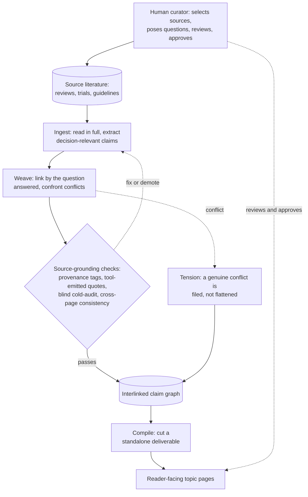

This is a **source-grounded appraisal** of the nutrition, exercise, and lifestyle evidence: what an
exposure does, *for whom*, *how much*, and *how confident we should be* — with every claim traced back to
the study or guideline it came from.

Everything here is built around one test: **would this change what someone actually does — on an outcome
they care about — in a way they couldn't already have worked out?** Being true isn't enough; a finding has
to be *useful* and *not already obvious* to earn a place. That's also why some topics that fill a lot of
column inches elsewhere get a single line here: when the honest answer is "it barely moves the needle,"
that *is* the answer, and it doesn't need a page.

This page has two halves: **what the guide is and how it judges**, then **how it is actually built and
maintained** — because a big part of trusting it is understanding how the pages came to be. For the
narrower question of *how far* to trust it — where judgment enters, and what it deliberately does not do —
see [Can you trust this guide?](trust)

## Part 1 — What it is, and how it judges

### What makes it different

- **Ranked by effect size × certainty — big rocks first.** Most of the achievable benefit sits in a
  handful of large exposures (not smoking, staying active, avoiding excess visceral fat, sleeping enough).
  The endless refinements share what's left. We say so plainly instead of burying the large levers among
  small ones.
- **Honest about uncertainty.** We keep four states apart — *benefit*, *harm*, *no meaningful effect*, and
  *not enough evidence to say* — and never let the last two blur together. Where the evidence is thin, we
  say the evidence is thin.
- **Surrogates are not outcomes.** A number that moves (cholesterol, blood sugar) is not the same as a life
  lived longer or better. We flag when a result rests on a marker rather than on what you actually care
  about.
- **Symmetric standards.** A long-standing recommendation earns no free pass from age or authority; a
  contrarian claim earns none from novelty. The same scrutiny applies to both.
- **Gaps are findings.** When the levers left for you are small and uncertain, that *is* the answer — it
  tells you it's okay to stop optimizing.

### What it covers

The scope is **modifiable exposures** — the things you can actually change — judged mostly by what they do
to physical health: how long you live, how well you age, cardiometabolic and musculoskeletal function, and
avoiding deficiency.

- **The core:** food and whole dietary patterns, physical activity and training, and sleep. This is where
  the large levers live, so it's where most of the attention goes.
- **The periphery, held to the same bar:** other lifestyle levers — heat and sauna, cold, sun and light,
  stress and how it's managed — and the trade-offs inside an exercise programme (load, recovery, injury).
  These earn a page when the evidence bears on a real outcome, not because they're in fashion; most turn out
  to be small-effect and stay short.
- **Drugs, where they're the realistic alternative.** A medication — a GLP-1 agonist, say — is often the
  honest comparison to a lifestyle change, and leaving it out would make the comparison unfair. We appraise
  what it does; we don't tell you to take it.
- **What's left out:** claims that can't be tested, or that have been measured and come up empty in humans.
  A practice earns a place only through a specific, checkable claim about a human outcome — never as an
  identity, a tradition, or a philosophy on its own.

### What evidence it leans on

Not all evidence is equal, and we try not to pretend otherwise.

- **Preferred, near the top:** systematic reviews, meta-analyses, and umbrella reviews (reviews of the
  reviews), plus the major guideline and consensus statements built on them. Pooling many studies is harder
  to fool than any single striking result.
- **Then:** individual randomized trials, large long-term cohorts, and natural experiments — including
  Mendelian randomization, which uses an accident of genetics as a kind of built-in randomization.
- **Fit-to-question over pedigree.** The right design depends on the question. Nutrition rarely allows the
  clean, decades-long, blinded trial you'd want (you can't blind a food or randomize a lifetime), so instead
  of demanding one perfect study we **triangulate** — reading trials, observational data, dose-response, and
  biological mechanism together, and weighing them against each other.
- **Mechanism can point a direction — it isn't proof.** A plausible biological pathway with some human
  support can tell us *which way* an effect probably runs; we mark it as such and note what would confirm or
  overturn it. A result in a petri dish or a mouse is a candidate, not a conclusion.
- **The caveat that shadows the whole field:** people misreport what they eat, by a lot. That measurement
  error is big enough to wash out real effects, so a flat or null dietary finding often means "we couldn't
  measure it well enough," not "there's nothing there." Where that's likely, we say so.

### The honest limits

- **This appraises evidence; it does not prescribe.** It says what the evidence shows for a group of people.
  Selecting, dosing, screening for contraindications, and managing your medications are things only a
  clinician who knows *you* can do. **This is not medical advice.**
- **A group is not a person.** Every finding is about a *reference class*. You may differ from it in ways
  that matter — which is exactly the judgment that belongs to you and your clinician, not to a page.
- **The loop is open.** This grades whether the reasoning is internally sound and faithful to its sources —
  **not** whether following it made anyone better off. A clean, well-sourced page can still be wrong about
  the world. Nothing here has been tested against real outcomes, and we don't pretend otherwise.

## Part 2 — How it is built and maintained

Knowing how the pages are produced is part of being able to trust them. Here is the machinery, in plain
terms — the information flow first, then each stage.

Two things the diagram deliberately shows. The **source-grounding checks are a gate, not an
afterthought** — nothing enters the graph until it passes, and the same checks run again when a
deliverable is compiled. And there is **no arrow back from real-world outcomes**: nothing here has been
tested against whether the advice actually helped anyone. That open loop is the central limit, spelled
out on the [trust page](trust#the-one-thing-to-know-first).

### Built as an LLM wiki

This guide is written and maintained differently from most. It is an **LLM wiki** — an idea suggested by
Andrej Karpathy: instead of a person composing articles, a large language model (Claude) reads the source
literature and maintains an interlinked knowledge graph, under a human curator's direction. The two roles
are kept distinct:

- **The human curates.** A single maintainer chooses what to read, poses the decision-questions, reviews
  the output, challenges it, and approves every change. The selection of questions and sources — and the
  final judgment — are human.
- **The model does the reading and the bookkeeping.** It extracts what bears on a decision, integrates it
  with what is already held, writes the cross-links, and runs the consistency checks — the labour that would
  make a hand-maintained graph of this size impossible for one person.

This is a genuine strength (breadth and consistency one person could not sustain) and a genuine risk (a
fluent model can write a plausible sentence its source does not support). The mechanisms below exist
specifically to hold that risk down, and the [trust page](trust) is candid about what they cannot fix.

### How a page comes to be

Pages are not written top-to-bottom; they *accrete* from sources through a few repeated operations:

- **Ingest** — a source is read in full and the decision-relevant parts are extracted, each tagged with
  where it came from. We keep what changes reasoning about what to do — not a summary of the paper.
- **Weave** — the extract is folded into the graph and linked to other pages **by the decision-question it
  answers**, not by topical similarity. Where it clashes with something already held, the clash is
  confronted before anything is reconciled.
- **Compile** — the reader-facing topic pages (the cards on the home page) are *cut* from that graph, with
  the underlying tensions resolved or named, into a standalone piece.

### How it stays source-grounded and consistent

The point of the discipline is that **every non-obvious claim either traces to a source or is marked as the
guide's own reasoning** — and that this is mechanically enforced, not merely intended:

- **Provenance is tagged on the claim.** An extracted claim carries its source; the guide's own inference
  is labelled as inference. You can always tell which is which.
- **Quotations are pulled from the source by tool, never retyped.** A quote is lifted directly from the
  source text so it cannot drift, get truncated before a qualifier, or be misattributed from memory.
- **A blind re-read checks every new claim.** After a page is written, a separate pass re-reads each
  attributed claim against *only* its cited source, with no other context, to catch anything the source
  does not actually say. Overstatements are demoted on the spot.
- **Pages are checked against each other.** Automated checks flag internal contradictions, claims that
  overstate their evidence, orphaned assertions with no source, and a claim retracted on one page but left
  standing on another.

None of this grades whether a claim is *true* — only whether it is faithful to its source and consistent
with the rest. That distinction is the single most important thing on the [trust page](trust).

### How disagreement between sources is handled

When good sources genuinely conflict, we do **not** quietly pick a winner:

- **The conflict is filed, not flattened.** Each side is stated in its own terms — the actual point of
  disagreement located — and the page shows *why* the evidence does not settle it, rather than averaging it
  into a mush.
- **When guideline bodies disagree with each other, that is itself the finding.** It means the evidence
  does not determine the answer, and the guide's job is to show that, not to referee it.
- **Before a "these disagree" claim is made,** we check that the two sources are answering the *same*
  question at the same scope — apparent contradictions are often two true statements about different things.

### How source quality is weighed

Every source carries a **tier** — from *gold* (a systematic review, umbrella review, or guideline with a
documented evidence base) down through *high*, *moderate*, *weak*, to *mechanism* (animal or test-tube). A
weak source is **labelled, not deleted** — in a thin field a clearly-marked weak source beats silence — but
it cannot quietly prop up a confident claim. How the tiers are assigned, and an honest account of how
sources were selected (including where selection was *not* systematic), are on the
[trust page](trust#how-sources-are-chosen).

---

For where judgment enters, who maintains it, the calibrated language, and how to challenge it, see
[Can you trust this guide?](trust)

[← Back to the guides](.)
